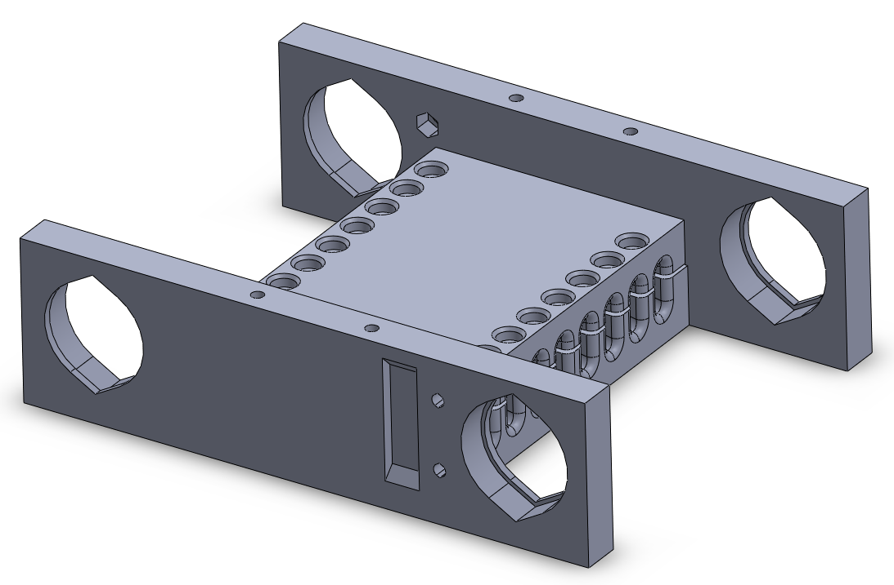
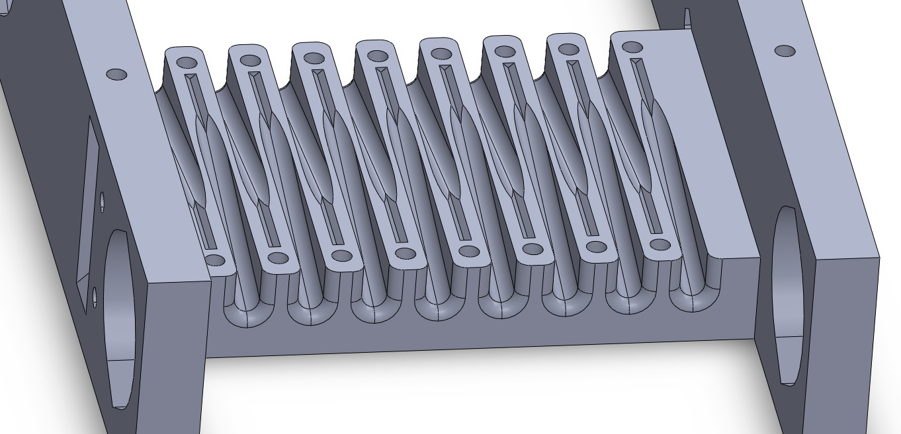
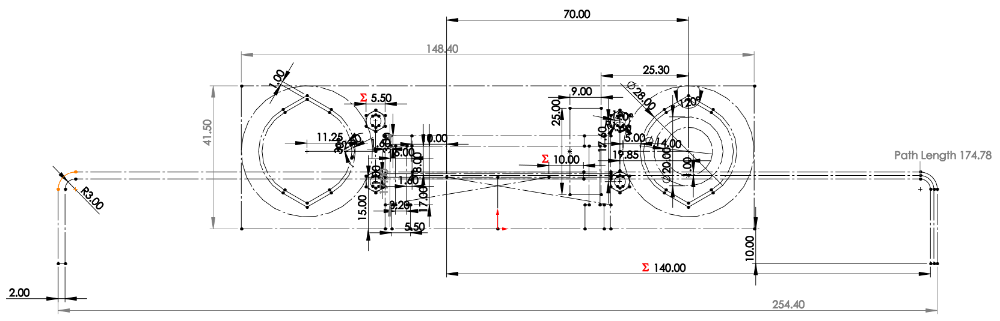
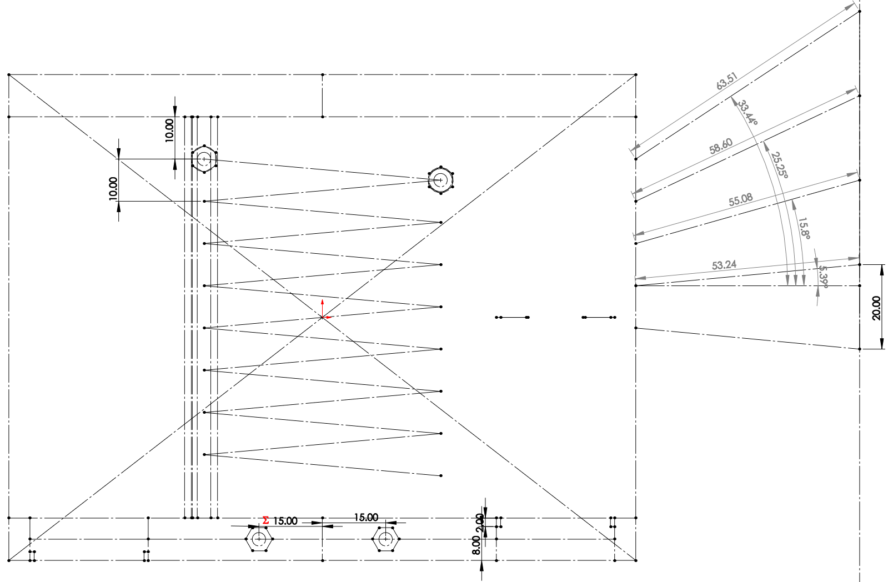

# HW12

## My mechanical system
I decided to spend (too much) time on the mechanical system of the robot, mostly because I thought it would be neat to have a robot that didn't have wheels. So, I am covering that here rather than the intended assignment of a laser cut box (if that is OK).

I wanted to talk a little bit about my approach to the chassis, then the cams, since they both have some interesting things going on in Solidworks. Here is the overall chassis of the robot. Note the V-shapes at the tops and bottoms of the holes. This helps with printing, and doesn't have a huge impact on strength.

Here you can see with a clamping piece removed, showing where the wire legs will attach to the body. Plenty of screws, and the portion where the wire is clamped is actually a V-shape rather than semicircular so that it prints a bit better. 

My strategy for a complex part like this usually involves one or more master sketches. In this case, I use one sketch that looks at the chassis from the front. I try to draw as many features as I need on this sketch, pretending I can see through the part. Then, I drew a sketch as viewed from the top of the robot. Now, I create sketches like normally, but instead of drawing lines, adding dimensions, etc., I just project the lines from these two sketches, and work mainly using constraints. This helps to create nicely parametric parts, where the only sketches I need to change will mainly be these master sketches.

Here is a video of the finished mechanical assembly moving. Note the low speed and high load on the motor, not ideal. But still neat.
https://youtu.be/gqT_wQ0AosU