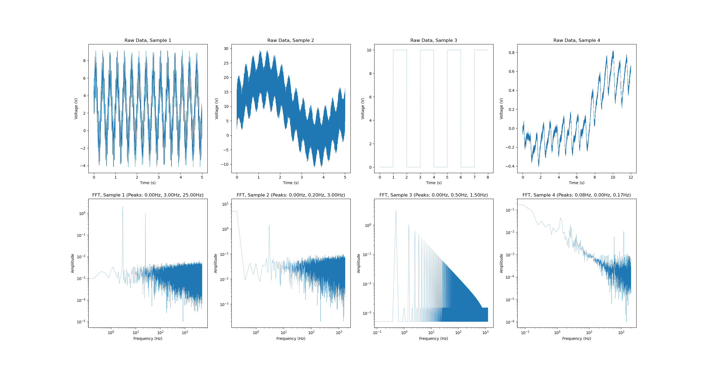
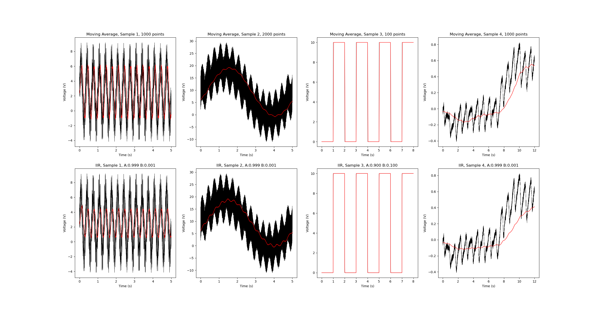
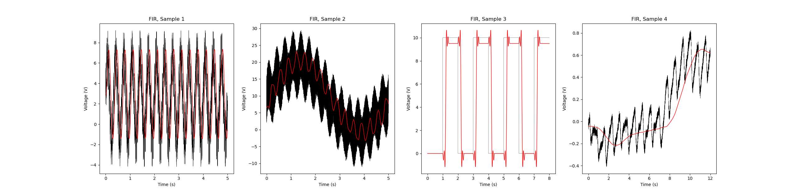

# HW9
## Raw data and fast Fourier transform (FFT)
The raw data from each of the CSV files is plotted below, along with the corresponding FFT. Data set A is furthest left, and set D is furthest right. The top 3 frequencies found by the FFT are listed in the FFT title. These were then used to select a cutoff frequency later. 

## Moving average filter (MAF) and infinite impulse response (IIR) filter
The results from applying a moving average filter are in the top row, and the results from the IIR are in the bottom row. The unfiltered data is shown in black, with the filtered result in red. The number of samples for the moving average filter and the values of A and B for the IIR are listed in each plot's respective title.

I applied the moving average filter by creating a convolution function, and I inserted data points equal to the first and last data points at the beginning and end of the data, respectively, to supply the "missing" data for the start and finish of the convolution. This made it easier later to implement the FIR as it just requires a special set of convolution weights.

## Finite impulse response (FIR) filter
I implemented the code from [this website](https://www.arc.id.au/FilterDesign.html) to automatically generate a Kaiser-Bessel FIR filter. A used a low-pass filter with a cutoff frequency of 10 Hz for all, along with their corresponding sample frequencies and an attenuation of 10 dB. I used 999 points.  
